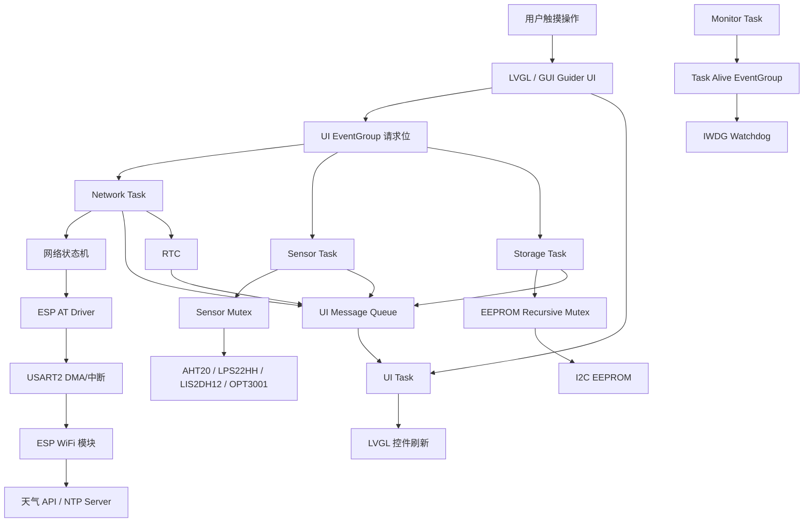
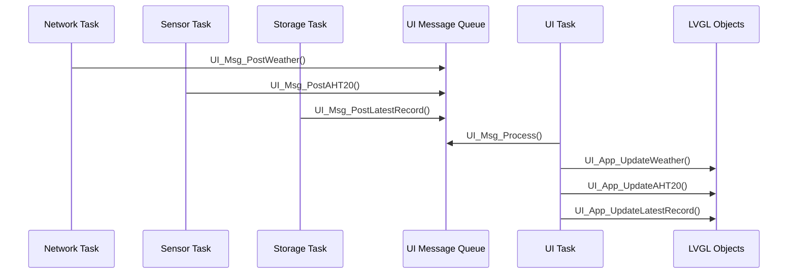

# Mywatch V3 - STM32F407 FreeRTOS 天气时钟

Mywatch V3 是一个基于 **STM32F407VETx + FreeRTOS + LVGL** 的嵌入式天气时钟项目。系统集成了触摸屏 UI、WiFi 联网、天气获取、SNTP 网络校时、RTC 本地计时、环境传感器采集、EEPROM 本地记录和 IWDG 看门狗监控，目标是实现一个可长期运行、可交互、可记录数据的嵌入式桌面天气时钟。

## 功能特性

- 基于 LVGL 和 GUI Guider 实现触摸式天气时钟界面。
- 通过 ESP AT 模块连接 WiFi。
- 通过 SNTP 获取网络时间，并写入 STM32 RTC。
- 支持 RTC Backup Register，普通复位后保留已同步时间。
- 通过天气 API 获取实时天气，并显示城市、天气、温度、更新时间等信息。
- 采集 AHT20 温湿度、LPS22HH 气压、LIS2DH12 运动状态、OPT3001 光照数据。
- 使用 EEPROM 保存配置、事件日志和历史记录。
- 支持配置驱动的周期调度：自动刷新天气、自动采样、自动保存历史记录。
- 支持 LCD 背光亮度设置，并将配置保存到 EEPROM。
- 使用 Monitor Task + IWDG 实现任务健康监控和看门狗保护。
- 对 LVGL UI 更新、EEPROM、I2C 传感器访问进行了多任务安全保护。

## 硬件平台

| 模块 | 说明 | 接口 | 相关文件 |
|---|---|---|---|
| MCU | STM32F407VETx | Cortex-M4 | `MDK-ARM/V1.uvprojx` |
| LCD | ST7789 屏幕 | SPI2 + GPIO | `Core/Src/lcd_st7789.c` |
| 触摸 | FT5336 | I2C3 + EXTI | `Core/Src/ft5336.c` |
| WiFi | ESP AT 模块 | USART2 + DMA/中断 | `Core/Src/esp_at.c` |
| 调试串口 | 日志输出 | USART1 | `Core/Src/main.c`, `Core/Src/usart.c` |
| EEPROM | 配置、日志、历史记录 | I2C1 | `Core/Src/eeprom.c` |
| 温湿度 | AHT20 | I2C2 | `Core/Src/aht20.c` |
| 气压 | LPS22HH | I2C2 | `Core/Src/lps22hh.c` |
| 加速度 | LIS2DH12 | I2C2 | `Core/Src/lis2dh12.c` |
| 光照 | OPT3001 | I2C2 | `Core/Src/opt3001.c` |
| RTC | 本地时间保持 | LSE/LSI | `Core/Src/rtc.c`, `Core/Src/app_time.c` |
| 背光 | LCD 背光 PWM | TIM9_CH1 | `Core/Src/lcd_backlight.c` |
| 看门狗 | 独立看门狗 | IWDG | `Core/Src/iwdg.c` |

## 主要引脚

| 外设 | 引脚 | 用途 |
|---|---|---|
| USART1_TX/RX | PA9 / PA10 | 调试串口 |
| USART2_TX/RX | PA2 / PA3 | ESP AT 通信 |
| I2C1_SCL/SDA | PB6 / PB7 | EEPROM |
| I2C2_SCL/SDA | PB10 / PB11 | 环境传感器 |
| I2C3_SCL/SDA | PA8 / PC9 | FT5336 触摸 |
| SPI2_SCK | PB13 | LCD SPI 时钟 |
| SPI2_MOSI | PC3 | LCD SPI 数据 |
| SPI2_MISO | PC2 | SPI 输入 |
| TIM9_CH1 | PE5 | LCD 背光 PWM |

## 软件技术栈

- MCU：STM32F407VETx
- IDE：Keil MDK-ARM
- 编译器：ARM Compiler 5.06
- HAL：STM32Cube HAL
- RTOS：FreeRTOS
- GUI：LVGL + GUI Guider
- 网络：ESP AT、WiFi、HTTP、SNTP
- 存储：I2C EEPROM
- 通信与同步：Queue、EventGroup、Mutex、Recursive Mutex、StreamBuffer、Task Notification
- 调试：USART printf 日志、Keil Build Log、串口启动日志

## 工程目录

```text
Core/
  Inc/                 应用层和驱动头文件
  Src/                 应用层、驱动和外设初始化源码
Drivers/
  CMSIS/               CMSIS 设备支持
  STM32F4xx_HAL_Driver STM32 HAL 驱动
LVGL/
  app/                 UI 业务适配层
  generated/           GUI Guider 生成代码
  port/                LVGL 显示和触摸移植层
Middlewares/
  Third_Party/FreeRTOS FreeRTOS 源码
MDK-ARM/
  V1.uvprojx           Keil 工程文件
V1.ioc                 STM32CubeMX 配置文件
Readme.md              项目说明文档
```

## 系统架构



## FreeRTOS 任务设计

| 任务 | 优先级 | 栈大小 words | 周期/等待 | 主要职责 |
|---|---:|---:|---|---|
| UI Task | 5 | 2048 | 5 ms | 处理 LVGL、UI 消息、时间显示刷新 |
| Monitor Task | 4 | 512 | 启动宽限 3 s，周期检查 | 检查任务 alive 位，健康时喂 IWDG |
| Network Task | 3 | 1536 | 等待 ESP RX，最长约 100 ms | WiFi、SNTP、天气、自动重连 |
| Sensor Task | 2 | 1024 | 200 ms | 传感器初始化、周期采样、手动刷新 |
| Storage Task | 1 | 1024 | 200 ms | 保存历史、清日志、亮度配置保存 |

任务创建代码位于：

```text
Core/Src/app_freertos.c
```

业务任务代码位于：

```text
Core/Src/app_tasks.c
```

## 关键设计说明

### 1. LVGL 线程安全

LVGL 默认不是线程安全的。本项目规定只有 **UI Task** 可以直接调用 LVGL 控件更新函数，其他任务只能通过 `UI_Msg_Post...()` 把消息发给 UI Task。



这样可以避免多个任务同时操作 LVGL 对象导致偶发崩溃或界面异常。

### 2. ESP AT 异步收发

ESP AT 驱动中使用了：

- `StreamBuffer`：保存 UART 中断接收到的字节流。
- `Task Notification`：UART 收到数据后唤醒 Network Task。
- 异步接口：`ESP_AT_AsyncStart()`、`ESP_AT_AsyncPoll()`。

UART 中断只负责收数据，不在中断里做复杂字符串解析。Network Task 被唤醒后再解析 AT 响应，降低中断负担，也避免响应缓冲区并发访问风险。

### 3. 网络状态机

Network Task 中将联网流程拆成多个状态：

```text
AT_TEST_START -> AT_TEST_WAIT
ECHO_OFF_START -> ECHO_OFF_WAIT
WIFI_START -> WIFI_WAIT
SNTP_GET_START -> SNTP_GET_WAIT
WEATHER_START -> WEATHER_WAIT
```

每个状态只做一小步，等待期间不会长时间阻塞整个系统。这样 UI、传感器和存储任务仍能继续运行。

### 4. 自动重连和周期刷新

系统支持：

- WiFi 失败后自动重连。
- 周期检查 WiFi 状态。
- WiFi 连接成功后自动同步时间和刷新天气。
- 按配置周期自动刷新天气。

默认配置：

| 参数 | 默认值 |
|---|---:|
| 天气刷新间隔 | 60 分钟 |
| 传感器采样间隔 | 600 秒 |
| 历史记录保存间隔 | 3600 秒 |
| 默认城市 | `beijing` |
| 默认亮度 | 80% |

### 5. EEPROM 数据设计

EEPROM 保存三类数据：

| 数据 | 结构体 | 说明 |
|---|---|---|
| 配置 | `EEPROM_AppConfig_t` | 亮度、刷新间隔、城市等 |
| 历史记录 | `EEPROM_HistoryRecord_t` | 传感器、天气、时间戳 |
| 事件日志 | `EEPROM_EventRecord_t` | WiFi、天气、错误等事件 |

EEPROM 记录包含：

```text
magic
version
sequence
checksum
```

这些字段用于判断数据是否有效、支持后续版本升级，并检测数据损坏。

EEPROM 驱动使用 Recursive Mutex 保护，避免多个任务同时写 EEPROM 或同时更新序号、header。

### 6. 传感器访问保护

AHT20、LPS22HH、LIS2DH12、OPT3001 共用 I2C2。Sensor Task 和 Storage Task 都可能触发传感器读取，因此本项目使用 Sensor Mutex 保护整组传感器 I2C 访问，避免 I2C 总线冲突。

传感器初始化放在 Sensor Task 中执行，不阻塞系统启动和 UI 显示。即使某个传感器异常，系统也能继续进入主界面。

### 7. RTC 与 SNTP 校时

系统启动时会检查 RTC Backup Register：

- 如果备份标记有效，并且 RTC 时间合法，则保留 RTC 时间。
- 如果无效，则设置默认时间，等待 SNTP 同步。
- 联网后通过 SNTP 获取时间，解析成功后写入 RTC。

RTC 当前优先使用 LSE。若 LSE 异常，代码中带有 LSI 兜底逻辑。

### 8. Monitor Task 与 IWDG

Monitor Task 定期检查任务 alive 位：

```text
APP_EVENT_UI_ALIVE
APP_EVENT_NETWORK_ALIVE
APP_EVENT_SENSOR_ALIVE
APP_EVENT_STORAGE_ALIVE
```

只有关键任务都正常上报 alive，Monitor Task 才刷新 IWDG。若任务卡死，系统会因看门狗超时自动复位，提高长期运行可靠性。

## 编译与下载

开发环境：

- Keil MDK-ARM
- ARM Compiler 5.06
- STM32F4xx DFP 2.13.0
- ST-Link 下载器

编译步骤：

1. 打开 `MDK-ARM/V1.uvprojx`。
2. 选择 Target `V1`。
3. 点击 Build。
4. 使用 ST-Link 下载到 STM32F407VETx 开发板。

命令行编译示例：

```powershell
& 'C:\Keil_v5\UV4\UV4.exe' -b 'F:\MCU\learn\Mywatch\V3\MDK-ARM\V1.uvprojx'
```

## 串口调试

调试串口：

```text
USART1
PA9  TX
PA10 RX
```

推荐串口参数：

```text
波特率：115200
数据位：8
停止位：1
校验位：None
```

正常启动日志示例：

```text
Boot UART OK
RTC init start
RTC init done
App init before scheduler start
LCD init OK
Touch init OK
EEPROM init OK
Sensor init deferred
ESP receive start
LVGL init start
GUI init OK
FreeRTOS init done
Sensor init start
Sensor init done
```

## 常见问题

### 1. 屏幕黑屏

排查顺序：

1. 串口是否输出 `Boot UART OK`。
2. 是否输出 `LCD init OK`。
3. 是否输出 `Config applied, brightness=xx%`。
4. 检查背光 PWM 和 LCD 供电。
5. 检查是否输出 `LVGL port init OK` 和 `GUI init OK`。

当前代码已对亮度配置做最小值保护，避免保存 0% 亮度导致启动黑屏。

### 2. 时间一直是 2000-01-01

可能原因：

- RTC 备份寄存器无效。
- 没有 RTC 电池或 VBAT 未供电。
- WiFi 未连接。
- SNTP 尚未同步到有效年份。

正常情况下，同步成功会打印：

```text
RTC sync OK
```

### 3. 传感器初始化失败

查看串口日志：

```text
AHT20 init failed, code=x
LPS22HH init failed, code=x
LIS2DH12 init failed, code=x
OPT3001 init failed, code=x
```

重点检查：

- I2C2 接线。
- 上拉电阻。
- 传感器供电。
- 传感器地址。
- 模块焊接是否正常。

### 4. WiFi 连接失败

重点检查：

- SSID 和密码。
- 手机热点是否为 2.4 GHz。
- ESP AT 固件是否正常。
- USART2 接线和波特率。
- USART2 中断优先级是否为 5。

## 后续规划

- 增加 Logger Task 或 UART DMA 日志输出，减少 `printf()` 对任务运行的影响。
- 增加 I2C 总线错误恢复机制，提高传感器异常后的自恢复能力。
- 增加更多 UI 设置项，例如城市、刷新间隔、亮度策略等。
- 增加运行照片或短视频，提升 GitHub 展示效果。
